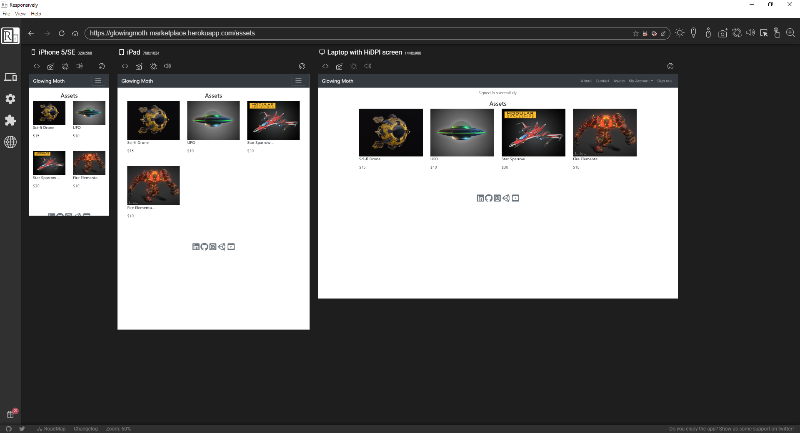
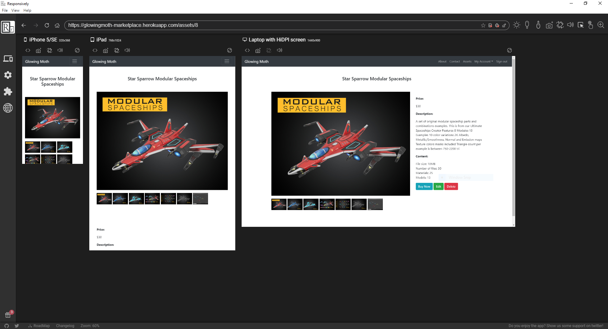
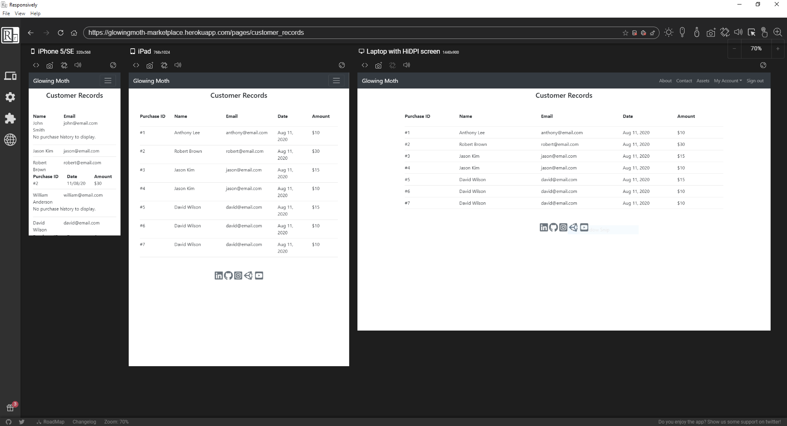
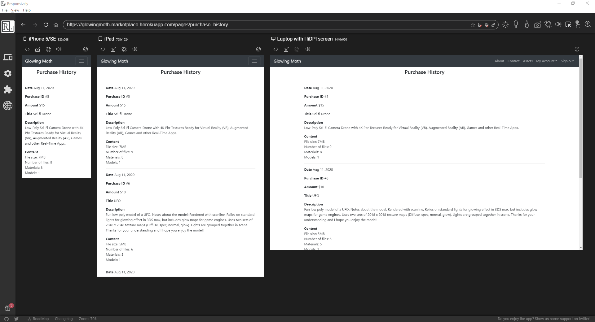
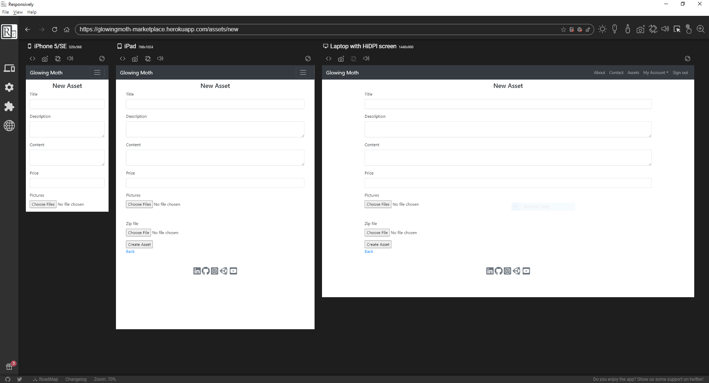
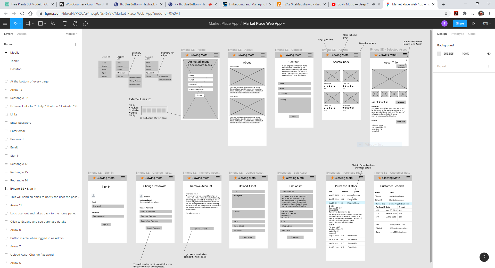
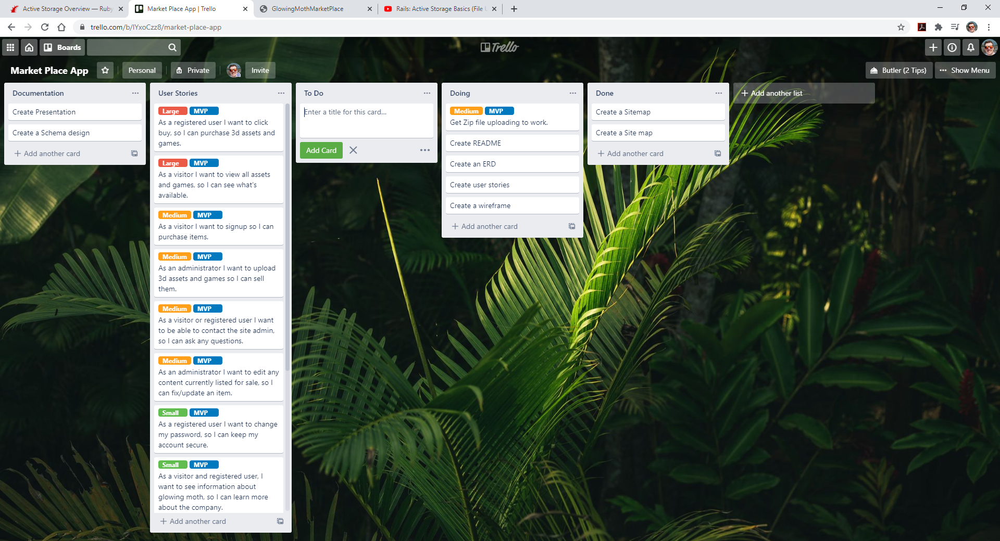
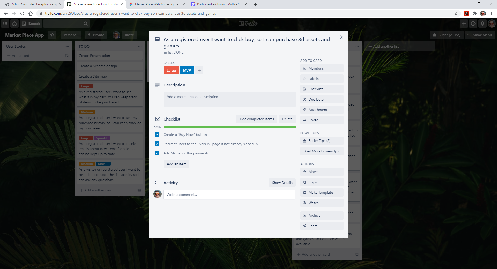
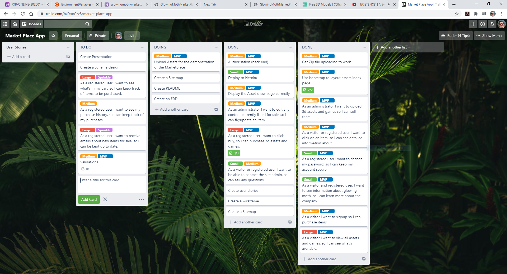
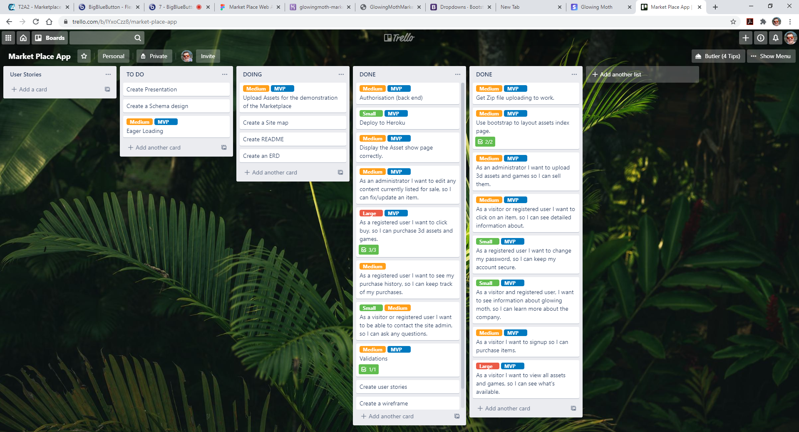

## R7 - Identification of the problem you are trying to solve by building this particular marketplace app 
My background has been 3d art for games, I also have two brothers that make music. I consider myself now to be in the process of becoming an independent game developer on the side whilst of course studying web development. My marketplace application will serve as a way to sell 3d art/assets to users that sign up.
Glowing Moth is my Indie name, and so it only makes sense to call my marketplace application the same. I have already sold assets on the Unity Asset Store, a very big marketplace for indie developers, however they take 30% of the sale. Using my own market place will dramatically reduce this cost, though I will obviously miss out on most of the traffic unity offers, I'm ok with this for the purpose of this assignment.

## R8 - Why is it a problem that needs solving? 
This is mainly a problem for myself regarding the fees I need to pay Unity Asset Store, however it may benefit the users that sign up, as I will be able to lower my prices, allowing other users/developers to purchase assets cheaper than they would normally be able to on the Unity Asset Store.

## R9 - A link (URL) to your deployed app (i.e. website) 
[Glowing Moth Marketplace App - Heroku](http://glowingmoth-marketplace.herokuapp.com/users/sign_up)

## R10 - A link to your GitHub repository (repo). 
[Glowing Moth Marketplace App - Github Repository](https://github.com/glowingmoth/glowing_moth_market_place)

## R11 - Description of your marketplace app (website), including:
- **Purpose** - The main reason for the Glowing Moth Marketplace is to provide a way for myself to sell game assets that can be used by other indie game developers, and to reduce the cost that come with hosting them elsewhere.
- **Functionality / features** - Users have the ability to sign up and purchase assets. They can also change their password and or remove their account. There is a contact form to contact myself the admin. As an admin I can set what users have access to in terms of menu items. Currently as an admin I have the ability to upload assets that contain text descriptions, images and an attached file in the form of a zip, as well as being able to edit or delete an asset from being listed. After a user purchases an asset the can download the asset. The application is also mobile and tablet friendly.
- **Sitemap** 
Glowing Moth Marketplace App Sitemap

- **Screenshots** 
Glowing Moth Marketplace App Screenshots

- **Target audience** - This marketplace app is aimed at professional independent game developers or any other professionals in realtime computer graphics needing 3d assets for their projects. It's also aimed at hobbyists.
- **Tech stack** - HTML, CSS, Bootstrap, Ruby, Ruby on Rails, Javascript, Amazon Web Services S3, Heroku, Visual Studio Code, Figma, Lucid Charts, Stripe, Git, Github.

## R12 - User stories for your app 
- As an administrator I want to upload 3d assets and games so I can sell them.
- As an administrator I want to edit any content currently listed for sale, so I can fix/update an item.
- As a visitor or registered user I want to click on an item, so I can see detailed information about.
- As a registered user I want to change my password, so I can keep my account secure.
- As a visitor and registered user, I want to see information about glowing moth, so I can learn more about the company.
- As a visitor I want to sign up so I can purchase items.
- As a visitor I want to view all assets and games, so I can see what's available.
- As a registered user I want to click buy, so I can purchase 3d assets and games.
- As a registered user I want to see my purchase history, so I can keep track of my purchases.
- As a visitor or registered user I want to be able to contact the site admin, so I can ask any questions.

## R13 - Wireframes for your app 
[Link to Glowing Moth Marketplace App Wireframes - Figma](https://www.figma.com/file/aN7PX0cA94nccgUNs46Y7x/Market-Place-Web-App?node-id=0%3A1)

## R14 - An ERD for your app 
The ERD is look relatively simple and this is no doubt due to the fact of only one administrator/seller. With all other gems installed the ERD is of course more complex.

## R15 - Explain the different high-level components (abstractions) in your app 
The Glowing Moth Marketplace App: 

**Registration** - The marketplace requires user to register by creating an account in order to purchase any assets. 

**User Roles** - Allows for different user roles where you may set any user to be an administrator and or customer. Different roles will prevent customers from seeing unneeded data as well as confidential data to maintain data integrity. 

**Asset Uploading** - As an admin you can upload assets and attach a file for download once a user purchases the asset. You also have the option to edit the asset or remove it from the marketplace 

**Customer Records** - Allow you to see information related to their purchases like the date, the asset and price etc. 

**Payments** - Using Stripe the marketplace allows payments to be made and generate income from a business perspective. 

**Purchase History** - Customers can view their own purchase history for their own convenience. 

## R16 - Detail any third party services that your app will use 
- Amazon Web Services S3 - To store dynamic images that a uploaded for each asset, the app uses an S3 bucket provided by AWS.
- Stripe - For processing payments Stripe is used to take care of everything in terms of the payment platform and security. It off a complete payment infrastructure with analytics etc.
- Devise - Was chosen to simplify the need for user authentication by coming mostly prebuilt with sign up, sign in sign out etc. Devise has everything needed and universally used on the internet regarding authenticating users.
- Rolify - Provides the ability to set roles for each user. In the case of the market place, there was one seller/admin which can be set in rolify. This made it simple to set authorisations for users based on role.
- CanCan - Was actually used to set authorisations for the different users as set out by Rolify. 

## R17 - Describe your projects models in terms of the relationships (active record associations) they have with each other 
- User  
has_many :purchases 
has_many :assets, dependent: :destroy 

- Asset 
belongs_to :user
    has_many :purchases, dependent: :destroy 
    has_many_attached :pictures 
    has_one_attached :zip_file 
    
- Purchase 
  belongs_to :user 
  belongs_to :asset 

## R18 - Discuss the database relations to be implemented in your application 
When a user signs up they have the ability to purchase many assets and make many purchases. 
Each created asset has many images and A zip file attachment. When a purchase is made it will belong to the user and asset. Both assets and purchase will belong to a user. This allows the database to keep track of the user interactions within the marketplace. By using rolify and having an admin certain parts of the database relations become invisible to customers based on roles and authorisation.  
## R19 - Provide your database schema design 

**active_storage_attachments table** 
This allows the storing of the images and includes a foreign key to the blobs table that also works to store images/files.
- name
- record_type
- record_id
- blob_id

**active_storage_blobs table** 
Works with active storage.
- key 
- filename
- content_type
- byte_size
- checksum

**assets table** 
The assets table holds all info related to the asset that a customer can see on both the index and show page.
- title
- description
- content
- price
- user_id
- image

**purchases table** 
When a purchase is made this data is recorded and stored to allow for the admin to see customer records and customers to see their purchase history.
- date
- user_id
- asset_id
- price

**roles table**  
Works in conjunction with the users_roles table to set user roles.
- name
- resource_type
- resource_id

**users_roles_table**
Works with roles table to set user roles using the foreign keys.
- user_id
- role_id

**users table** 
This holds each user both admin and all customer data.
- name
- email 
- password 

## R20 - Describe the way tasks are allocated and tracked in your project 
[Link to task allocation - Trello ](https://trello.com/b/lYxoCzz8/market-place-app) 
Project management and task allocation utilised Trello where I broke things down into documentation, user stories, to do, do and done. I also found it helpful to implement colour coded labels to get a nice quick visual idea of priority tasks like MVP's. 
 
The first thing I began doing was to list things that needed to be done like starting the documentation and creating user stories as well as seting up a repository etc.

 
 

Next I continued to refine my ideas and ERD and sitemaps as well as starting to lay down the the basic source code for each model in the ERD. This was also the point where site layout and bootsrap were worked on.

 
 

Around this point I started to get an idea of scope and what features that were originally planned for the app were mostly likley not going to make it into the final product. I managed to implement several gems that helped with authentication authorisation, payments and image uploads etc. 

 
 

The final touches were things like validations and small tweaks here and there along with deployment to heroku. The last thing was to fill the database with fake users and complete the README.

