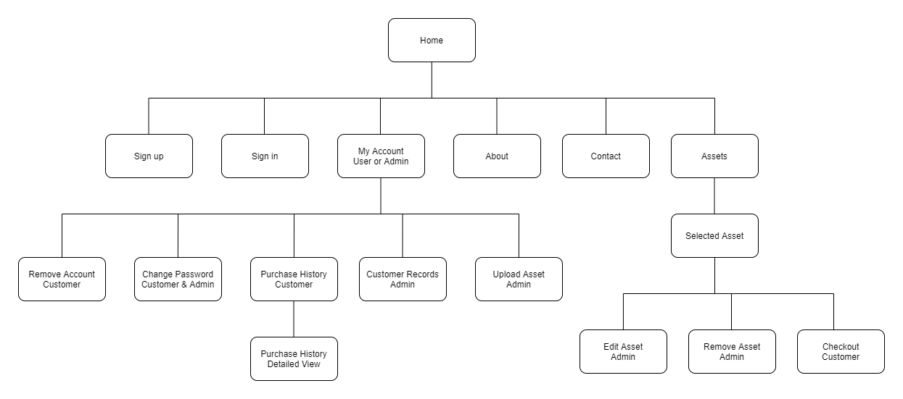
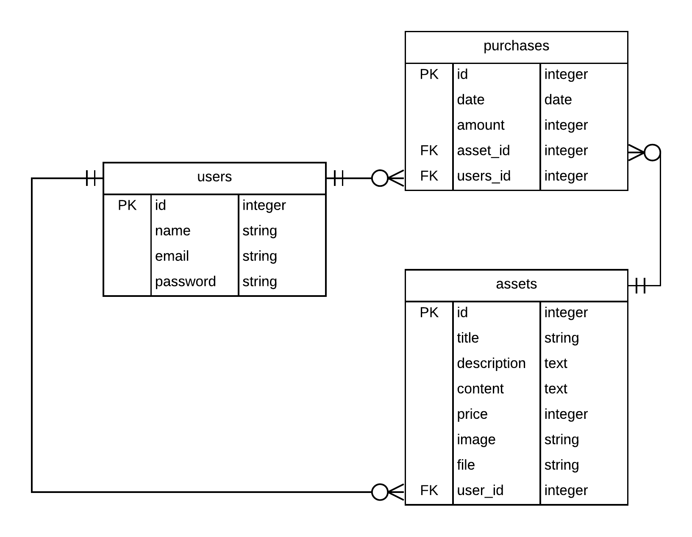

## R7 - Identification of the problem you are trying to solve by building this particular marketplace app 
My background has been 3d art for games, I also have two brothers that make music. I consider myself now to be in the process of becoming an independent game developer on the side whilst of course studying web development. My market place application will serve as a way to sell 3d art/assets to users that sign up.
Glowing Moth is my Indie name, and so it only makes sense to call my market place application the same. I have already sold assets on the Unity Asset Store, a very big market place for indie developers, however they take 30% of the sale. Using my own market place will dramatically reduce this cost, though I will obviously miss out on most of the traffic unity offers, I'm ok with this for the purpose of this assignment.

## R8 - Why is it a problem that needs solving? 
This is mainly a problem for myself regarding the fees I need to pay Unity Asset Store, however it may benefit the users that sign up, as I will be able to lower my prices, allowing other users/developers to purchase assets cheaper than they would normally be able to on the Unity Asset Store.

## R9 - A link (URL) to your deployed app (i.e. website) 
[Glowing Moth Marketplace App - Heroku](http://glowingmoth-marketplace.herokuapp.com/users/sign_up)

## R10 - A link to your GitHub repository (repo). 
[Glowing Moth Marketplace App - Github Repository](https://github.com/glowingmoth/glowing_moth_market_place)

## R11 - Description of your marketplace app (website), including:
- **Purpose** - The main reason for the Glowing Moth Marketplace is to provide a way for myself to sell game assets that can be used by other indie game developers, and to reduce the cost that come with hosting them elsewhere.
- **Functionality / features** - Users have the ability to sign up and purchase assets. They can also change their password and or remove their account. There is a contact form to contact myself the admin. As an admin I can set what users have access to in terms of menu items. Currently as an admin I have the ability to upload assets that contain text descriptions, images and an attached file in the form of a zip, as well as being able to edit or delete an asset from being listed. After a user purchases an asset the can download the asset. The application is also mobile and tablet friendly.
- **Sitemap** 
Glowing Moth Marketplace App Sitemap

- **Screenshots** 
Glowing Moth Maketplace App Screenshots

- **Target audience** - This marketplace app is aimed at professional independent game developers or any other professionals in realtime computer graphics needing 3d assets for their projects. It's also aimed at hobbyists.
- **Tech stack** - HTML, CSS, Bootstrap, Ruby, Ruby on Rails, Javascript, Amazon Web Services S3, Heroku, Visual Studio Code, Figma, Lucid Charts, Stripe, Git, Github.

## R12 - User stories for your app 
- As an administrator I want to upload 3d assets and games so I can sell them.
- As an administrator I want to edit any content currently listed for sale, so I can fix/update an item.
- As a visitor or registered user I want to click on an item, so I can see detailed information about.
- As a registered user I want to change my password, so I can keep my account secure.
- As a visitor and registered user, I want to see information about glowing moth, so I can learn more about the company.
- As a visitor I want to signup so I can purchase items.
- As a visitor I want to view all assets and games, so I can see what's available.
- As a registered user I want to click buy, so I can purchase 3d assets and games.
- As a registered user I want to see my purchase history, so I can keep track of my purchases.
- As a visitor or registered user I want to be able to contact the site admin, so I can ask any questions.

## R13 - Wireframes for your app 
[Link to Glowing Moth Marketplace App Wireframes - Figma](https://www.figma.com/file/aN7PX0cA94nccgUNs46Y7x/Market-Place-Web-App?node-id=0%3A1)

## R14 - An ERD for your app 

## R15 - Explain the different high-level components (abstractions) in your app 

## R16 - Detail any third party services that your app will use 
- Amazon Web Services S3 - To store dynamic images that a uploaded for each asset, the app uses an S3 bucket provided by AWS.
- Stripe - For processing payments Stripe is used to take care of everything in terms of the payment platform and security. It off a complete payment infrastructure with analytics etc.
- Devise - Was chosen to simplify the need for user authentication by coming mostly prebuilt with sign up, sign in sign out etc. Devise has everything needed and universally used on the internet regarding authenticating users.
- Rolify - Provids the ability to set roles for each user. In the case of the market place, there was one seller/admin which can be set in rolify. This made it simple to set authorisations for users based on role.
- CanCan - Was actually used to set authorisations for the different users as set out by Rolify. 

## R17 - Describe your projects models in terms of the relationships (active record associations) they have with each other 

## R18 - Discuss the database relations to be implemented in your application 

## R19 - Provide your database schema design 

## R20 - Describe the way tasks are allocated and tracked in your project 